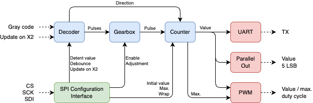
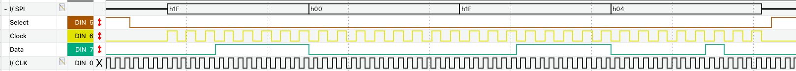
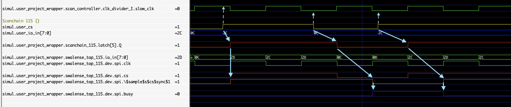
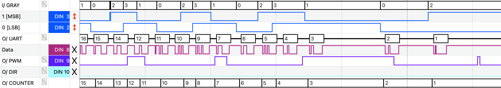

  

This repository contains a submission for the second round of Tiny Tapeout: a **configurable counter driven by 2-channel Gray code**.

TinyTapeout is an educational project that aims to make it easier and cheaper than ever to get your digital designs manufactured on a real chip!

Go to [https://tinytapeout.com](https://tinytapeout.com) for instructions!

# How it works

The module is an 8-bit configurable counter modified by Gray code (aka 2-bit quadrature code);
it aims at easing the integration of incremental rotary encoders into projects.
The counter value is given as a (truncated to 5 bits) parallel or (8 bits, no parity, 1 stop bit) serial UART output.
Other outputs include the "direction" of progression of the Gray code, and a PWM signal for which the duty cycle is proportional to the counter value.

Some basic (optional) debouncing logic is included; any pulse inverting the direction must be followed by a second pulse in the same direction
before the change is registered.

Additional features include support for wrapping (the counter rolls over at the minimum and maximum value),
and a "gearbox" that selects the X1 (1 pulse per 4 transitions), X2 (2 pulses) or X4 (4 pulses) output of the Gray code decoder driving the counter
depending on the speed at which the channels change; this can provide some form of "acceleration".
The initial and maximum values of the counter can also be set.  

Encoders with twice the number of detents compared to the number of pulses per round (e.g. 24 detents / 12 PPR) are supported 
by setting the input "update on X2" high or forcing it with the configuration parameter.

After reset the module is configured as a basic 5-bit counter which can then be further modified by sending a 32-bit word over the SPI interface.
This word sets the following options:

- (GBXEN) gearbox enable
- (WRPEN) wrap enable
- (DBCEN) debounce logic enable
- (VALX1) Gray code value for X1
- (UPDX2) force update on X2, this overrides a low value at the input pin (the value for X1 selects which transitions are taken into consideration)
- (GBXTMR) gearbox timer value
- (INIT) initial counter value after configuration
- (MAX) maximum counter value

|           | 31:24    | 23:16     | 15:8        | 7:6 | 5     | 4:3        | 2     | 1      | 0      |
|-----------|----------|-----------|-------------|-----|-------|------------|-------|--------|--------|
| **Bits**  | MAX[7:0] | INIT[7:0] | GBXTMR[7:0] |     | UPDX2 | VALX1[1:0] | DBCEN | WRPEN  | GBXEN  |
| **Reset** | 31       | 0         | 62          | 0   | 0     | 0          | 1     | 0      | 0      | 

# How to test

For a basic test connect a device generating Gray code and retrieve the counter value at the parallel or serial outputs with a microcontroller or other circuitry.

To further configure the module send some configuration word over the SPI interface (mode 0, MSB first, CS is active low).
The 32-bit configuration word is constructed as shown above.

The gearbox is implemented with a 5-bit threshold value; it is incremented by the X4 output of the decoder and decremented by a timer
(this threshold is then divided by 8 to select the gear, giving 0: X1, 1: X1, 2/3: X4).
Therefore, the result depends on the clock frequency and the speed at which the Gray code transitions. The gearbox timer is exposed to enable tuning
the interval between two updates by the timer.
For a rotary encoder with detents one can suggest using *clock_hz / (detents x transitions - 16)* as a starting point to determine a suitable value,
where detents is the number per turn (e.g. 24) and transitions is the number per detent (e.g. 4). That is, 62 for a common 24 detents / 24 PPR encoder at 5 kHz.

The 8-N-1 serial output shifts 1 bit out at each clock cycle. The receiving serial port therefore needs to be configured at the same speed as the clock.

The PWM frequency is derived from the maximum counter value. It might be unsuitable for visual feedback, e.g. driving a LED, for large values with a low
clock frequency as the LED will appear blinking.

# IO

| # | Input        | Output             |
|---|--------------|--------------------|
| 0 | clock        | UART serial output |
| 1 | reset        | PWM signal         |
| 2 | channel A    | direction          |
| 3 | channel B    | counter bit 0      |
| 4 | update on X2 | counter bit 1      |
| 5 | SPI CS       | counter bit 2      |
| 6 | SPI SCK      | counter bit 3      |
| 7 | SPI SDI      | counter bit 4      |

# Errata
## SPI configuration interface

After manufacturing, it has been found that the SPI configuration interface improperly integrates with the scanchain of TT02.
The issue makes it virtually impossible to send the 32-bit configuration word without additional measures.

The following can be applied as a workaround:
- The module must be clocked internally by the "slow clock",
- CS and SCK must transition while the slow clock signal is low.

The issue appears when the change in CS or SCK is latched by the scanchain on the falling clock edge.
The signal gets sampled by the edge detector on the module rising clock edge (left in the diagram),
preventing properly detecting the change.
By contrast, the edge is successfully detected when CS or SCK changes when the clock is low (two changes on the right). 

## PWM output

When the counter is being decremented, the PWM signal can remain high for a complete cycle (see change from 3 to 2 in the example).

There is no workaround.

